# Uso do Mermaid para representação de ideias do livro de Urântia

[Mermaid](https://mermaid.js.org) é código aberto e gratuito para uso por qualquer pessoa, inclusive para fins comerciais.

## 🧾 Detalhes:

- **Licença**: MIT License  
  - Isso significa que você pode **usar, copiar, modificar, distribuir** e até incorporar em projetos comerciais **sem custo**.
  - Só é necessário manter o aviso de copyright e a licença.
- [Link para a documentação](https://mermaid.js.org/intro/)
- [Link para o código aberto](https://github.com/mermaid-js/mermaid)

### 🧩 Uso:

- Podemos usar para representar ideias e conceitos presentes no **Livro de Urântia** de modo muito simples.
- Suporte nativo em muitas plataformas como GitHub, Obsidian, Notion, VS Code (via extensões), etc.

## Como ler um diagrama de sequência

Leia de cima para baixo como no exemplo abaixo sobre a consciência da 

- **Objetos/Participantes**: estão no topo, representados por retângulos com nomes. Cada um tem uma **linha de vida** vertical.
- **Mensagens**: são setas horizontais entre as linhas de vida, indicando chamadas de métodos ou troca de mensagens. A ordem é de cima pra baixo (sequência temporal).
- **Setas cheias**: chamada de método ou envio de mensagem.  
- **Setas tracejadas**: retorno de chamada.  
- **Retângulos sobre a linha de vida**: indicam ativação (período em que o objeto está executando algo).
- **Loops, condições ou blocos alternativos**: aparecem com molduras (caixas retangulares com rótulos como `loop`, `alt`, `opt` etc.).

## Consciência da alma

Segue um resumo de como representar cada elemento do **diagrama de sequência UML** usando **Mermaid**:

Processo que se inicia num ser humano já com algum desenvolvimento espiritual até a chegada de novos potenciais na consciência da alma e sua subsequente atualização ou realização-parcial:

intelectual, moroncial, espiritual e pessoal - a consciência da mente, da alma e do espírito e a unificação delas na personalidade.

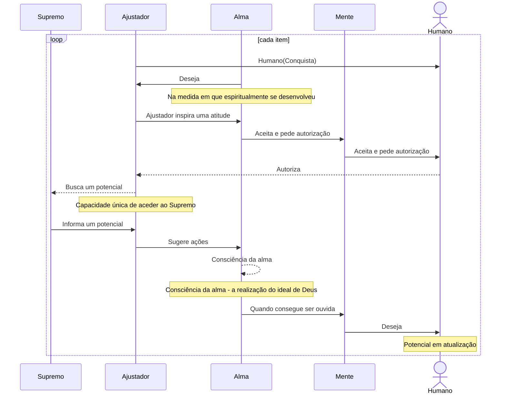

---

## Adoração

O processo de adoração é iniciado por um desejo da alma depois de mobilizar todos os poderes da personalidade humana (**<a href="javascript:showParagraph(5,3,7)" title="Abrir o parágrafo 5:3-7">5:3-7</a>**) sob domínio dela e é descrito como **"A mente mortal consente em adorar; a alma imortal anseia pela adoração e a inicia; a presença do Ajustador divino conduz essa adoração em nome da mente mortal e da alma imortal em evolução."** (**<a href="javascript:showParagraph(5,3,8)" title="Abrir o parágrafo 5:3-8">5:3-8</a>**).

   participant Ajustador
   Note over Ajustador: Espiritual
   participant Alma
   Note over Alma: Moroncial
   participant Mente
   Note over Mente: Intelectual
   actor Humano

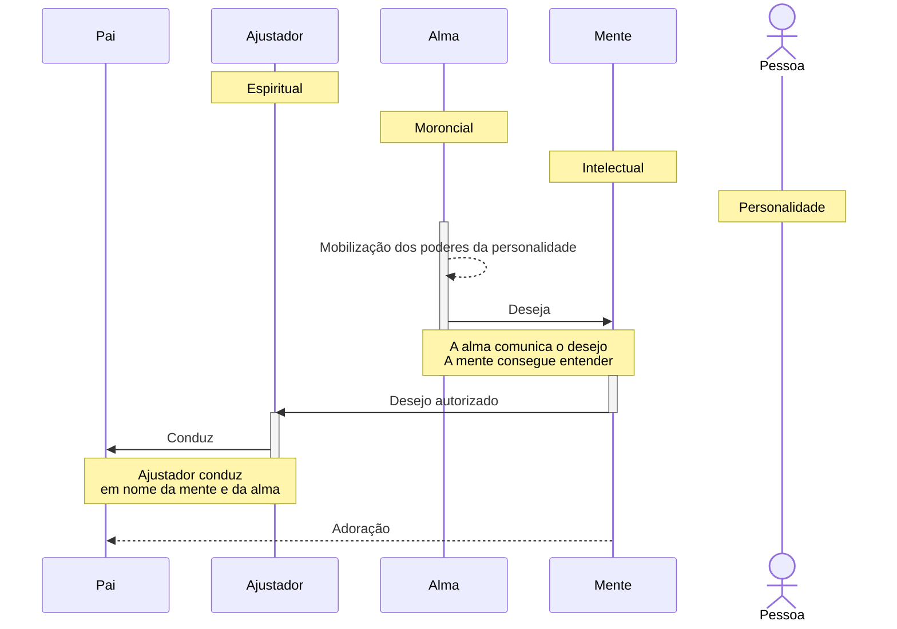

---

## Exemplos

### 🧍 Participantes / Objetos

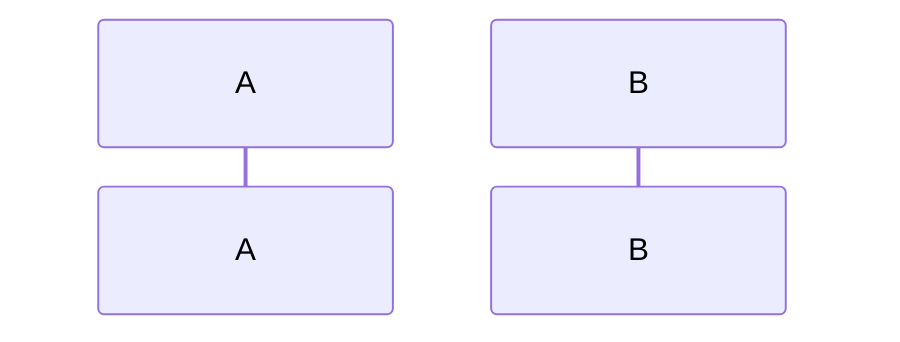

### ➡️ Mensagens (chamada de método)

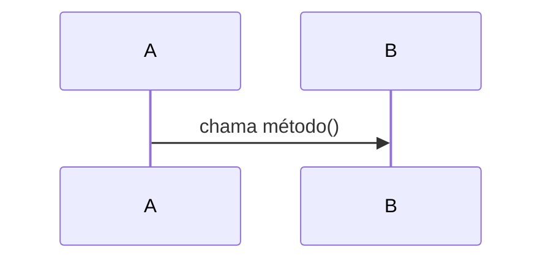

- `->>` é uma chamada síncrona  
- `-->>` é uma chamada assíncrona  

### 🔁 Retorno de chamada

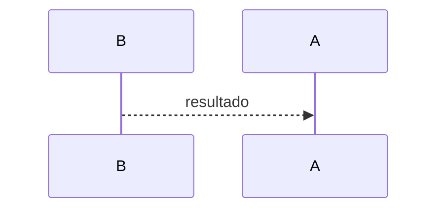

### 🔳 Ativação (implícita com chamadas)

Mermaid mostra barras de ativação automaticamente com chamadas síncronas (`->>`).

---

### 🔁 Loop

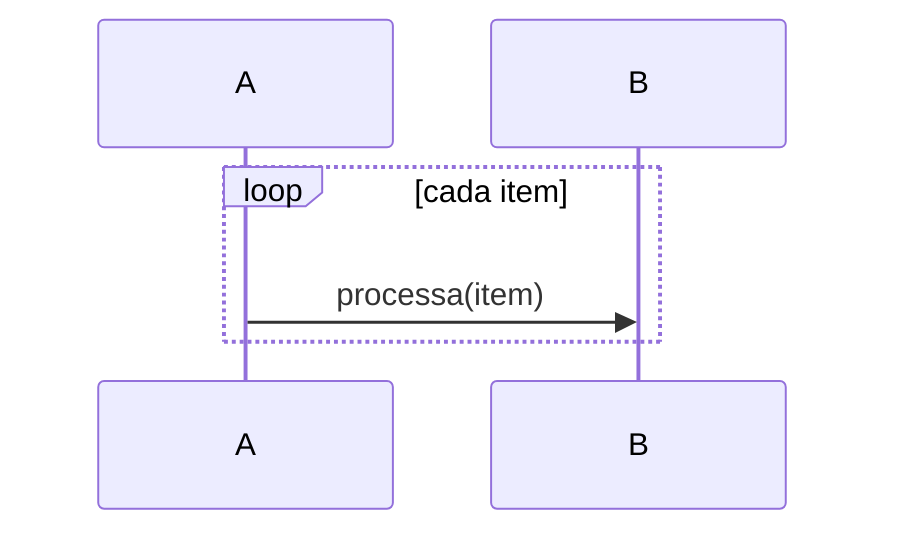

---

### 🔀 Alternativa (condicional)

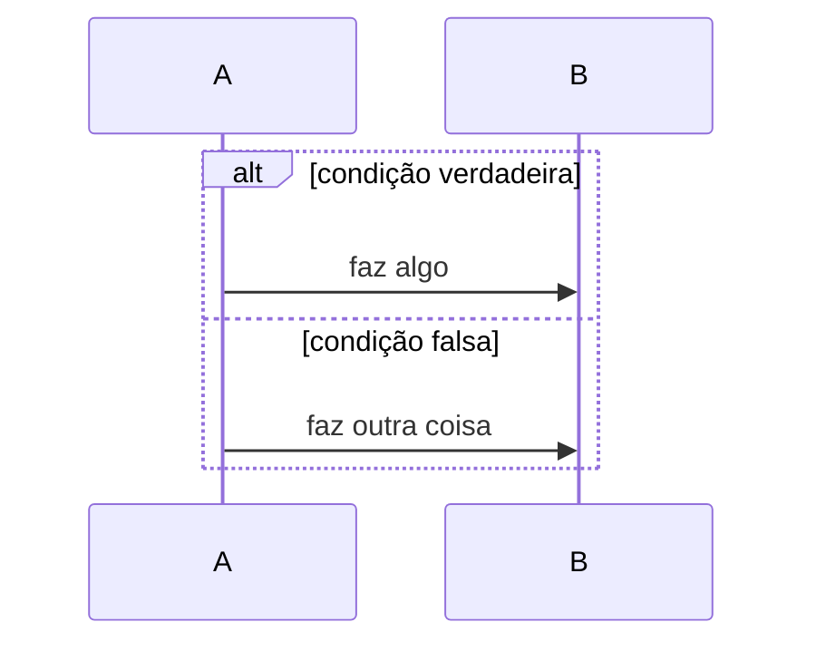

---

### ❓ Opção (tipo if sem else)

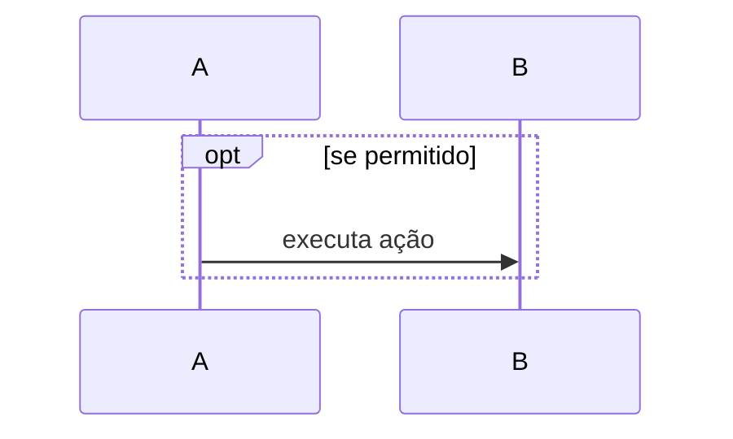

---

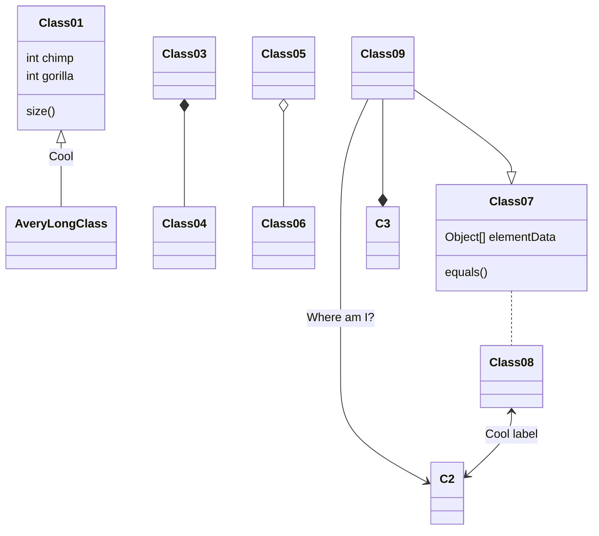
---
title: Simple sample

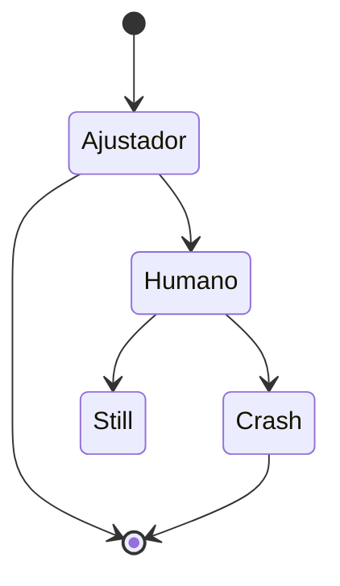

---
title: Order example

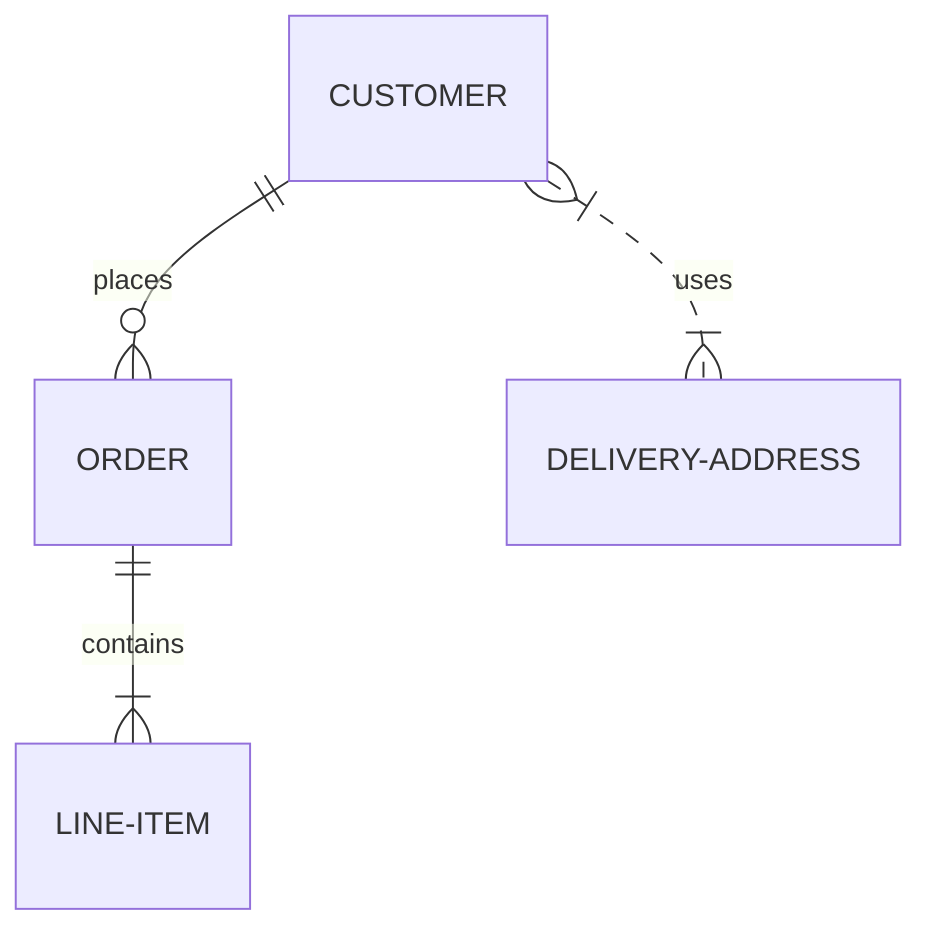

### Criando e removendo participantes

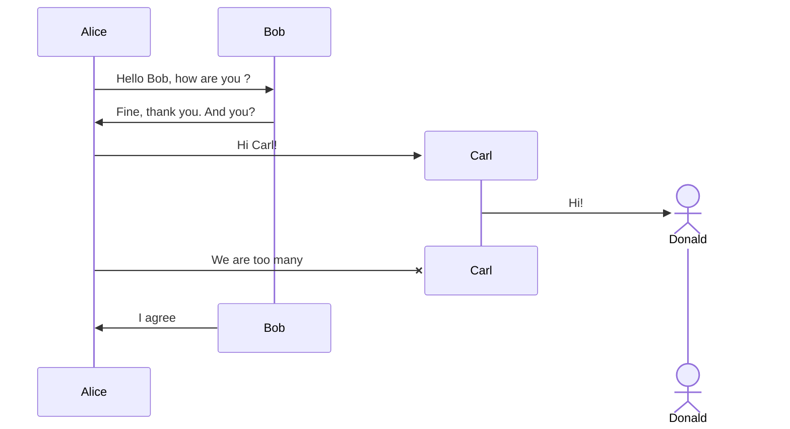
